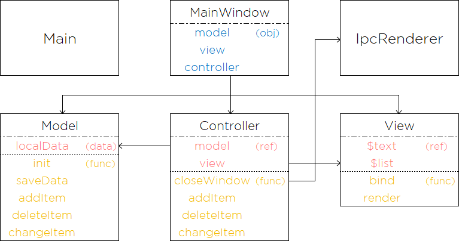

<h1 align="center">StickerTodo</h1>

  <code>StickerTodo</code>는 다중 플랫폼을 지원하는 데스크탑 어플리케이션 입니다.

## Modules

|Name|Electron|Node.js|JS|CSS|HTML|
|:-:|:-:|:-:|:-:|:-:|:-:|
|Version|1.12.2.|12.18.3.|Vanila|3|5|

## Structure

